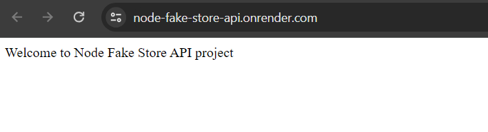
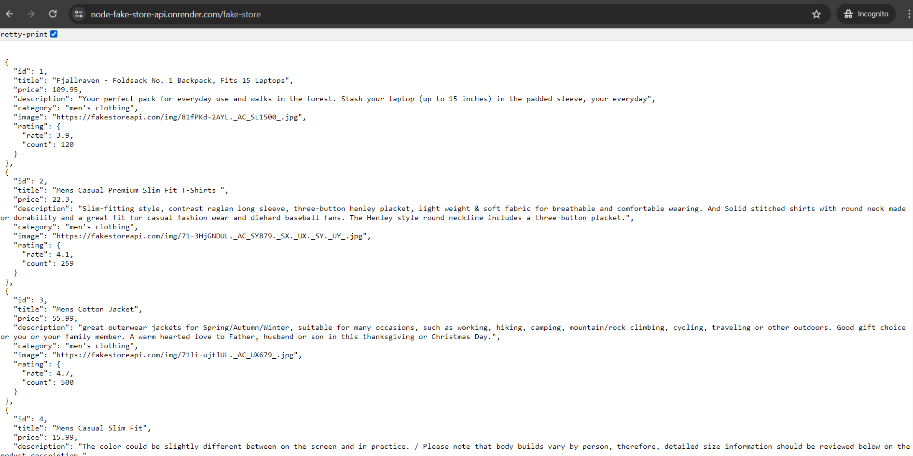

## Node Fake Store API

- This is the Node js project includes the integration of the fake store api `https://fakestoreapi.com/products` with an endpoint fake-store (Get method)

### View API Demo

- GET :https://node-fake-store-api.onrender.com
  
- GET (fake-store) :https://node-fake-store-api.onrender.com/fake-store
  

### To start the application

- Run `node index.js`

### Installing (One Time Process)

- Run `npm install`

### Installing Packages (One Time Process)

- Run `npm install express`
- Run `npm install axios`
